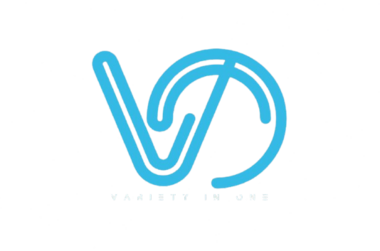
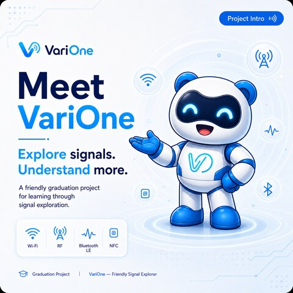

<p align="center">
  
</p>

<h1 align="center">VariOne</h1>

<p align="center"><b>One Device, Endless Signals.</b></p>

<p align="center">
  <i>A friendly, educational wireless-security device that makes the invisible signals<br>
  around you easy to <b>explore</b>, <b>understand</b>, and <b>learn</b> from.</i>
</p>

<p align="center">
  
  
  
  
  
</p>

<p align="center">
  
</p>

---

## 👋 Meet VariOne


The world is full of **invisible signals** — Wi-Fi, Bluetooth, sub-GHz radio, NFC, infrared. They're everywhere, yet most people never get to *see* them. **VariOne brings them into the open** so you can watch them, understand how they work, and learn how to defend against the ways they can be abused.

VariOne is a handheld **ESP32-S3 wireless-security awareness device** — a graduation project at **CIC New Cairo**, supervised by **Dr. Ahmed Gaber**. It's built on the excellent open-source [**Bruce**](https://github.com/pr3y/Bruce) firmware and retargeted to one purpose-built board: **VariOne S3**.

And say hello to **Vemo** 👉 — VariOne's mascot and on-device guide, who walks you through every tool with a friendly face. You'll see Vemo react across the UI as you explore.

<br clear="right">

---

## ✨ The idea in three words

<table align="center">
<tr>
<td align="center" width="33%">🔍<br><b>Explore</b><br><sub>Discover the signals<br>around you, live.</sub></td>
<td align="center" width="33%">🧠<br><b>Understand</b><br><sub>Visualize the data —<br>make the invisible visible.</sub></td>
<td align="center" width="33%">🎓<br><b>Learn</b><br><sub>Build real skills through<br>hands-on, guided practice.</sub></td>
</tr>
</table>

---

## 🧰 What it can do


VariOne packs a whole radio lab into one pocket device:

- 📶 **Wi-Fi** — access point, captive **VariPortal** (awareness/phishing demos), deauth, handshake capture, packet sniffer, **Channel Graph**, **Phone Probes**, host scanning.
- 🦷 **Bluetooth LE** — scanning, advertisement spam, and Bad-BLE (Ducky-style) scripting.
- 📡 **Sub-GHz radio (CC1101)** — scan, capture, replay and analyze remotes; band scanner; `.sub` files.
- 🪪 **RFID / NFC (PN532)** — read, clone, write and emulate cards and tags.
- 🎮 **Infrared** — TV-B-Gone, IR receiver, and custom IR send.
- 📻 **2.4 GHz (NRF24)** — spectrum view and jamming demos.
- ⌨️ **BadUSB** — run Ducky scripts (and even type out [Vemo ASCII art](badusb_payloads/)).
- 🤖 **AI Debrief** — after a session, VariOne explains *what just happened* in plain language.
- 🎨 **Vemo themed UI** + a mobile-friendly **Web control panel**.

<br clear="right">

---

## 🛡️ Responsible & authorized use

VariOne is a **teaching tool**. It is designed and operated **only inside formally authorized lab environments**, under signed NDAs, for education and authorized red-team training.

> **Please use it responsibly.** Never operate VariOne against networks, devices, or people you do not own or do not have **explicit written permission** to test. You are responsible for staying within the law.

---

## 🔩 Hardware


| Part | Detail |
| --- | --- |
| **MCU** | ESP32-S3 DevKitC-1 **N8R2** (8 MB flash · 2 MB PSRAM) |
| **Display** | 1.8″ **ST7735S** 128×160 color TFT (LovyanGFX) |
| **Sub-GHz** | **CC1101** transceiver |
| **2.4 GHz** | **NRF24L01** |
| **RFID/NFC** | **PN532** |
| **Storage** | microSD + on-chip LittleFS |
| **Infrared** | IR transmit + receive |
| **Input** | 6 buttons (D-pad + OK/BACK), long-press navigation |
| **Connectivity** | USB-C, USB-HID |

<br clear="right">

---

## 🚀 Build & flash


VariOne ships **one** board profile — `varione-s3` — and builds with [PlatformIO](https://platformio.org/):

```sh
pio run               # build firmware (default env: varione-s3)
pio run -t upload     # flash firmware over USB-C
pio run -t uploadfs   # flash the LittleFS image (Vemo theme, portal, payloads)
pio device monitor    # serial monitor @ 115200
```

That's it — a bare `pio run` targets the VariOne S3 board out of the box.

<br clear="right">

---

## 📱 Vemo Companion

VariOne pairs with a companion experience that turns your sessions into a friendly, gamified journey with Vemo — tracking what you've explored and learned. *(In development.)*

---

## 🙌 Credits

- Built on the open-source [**Bruce**](https://github.com/pr3y/Bruce) firmware by **pr3y**, **bmorcelli**, and the Bruce community — thank you. 💙
- **CIC New Cairo** graduation project, supervised by **Dr. Ahmed Gaber**.
- VariOne brand, Vemo mascot, hardware bring-up, and firmware integration by the VariOne team.

---

## 📄 License & disclaimer

VariOne inherits the **GNU AGPL-3.0** license from upstream Bruce. It is distributed for **legal, authorized security testing and education only**. The authors accept no liability for misuse — use at your own risk, and always with permission.

<p align="center"><sub><b>VariOne</b> — Friendly Signal Explorer · <i>One Device, Endless Signals.</i></sub></p>
